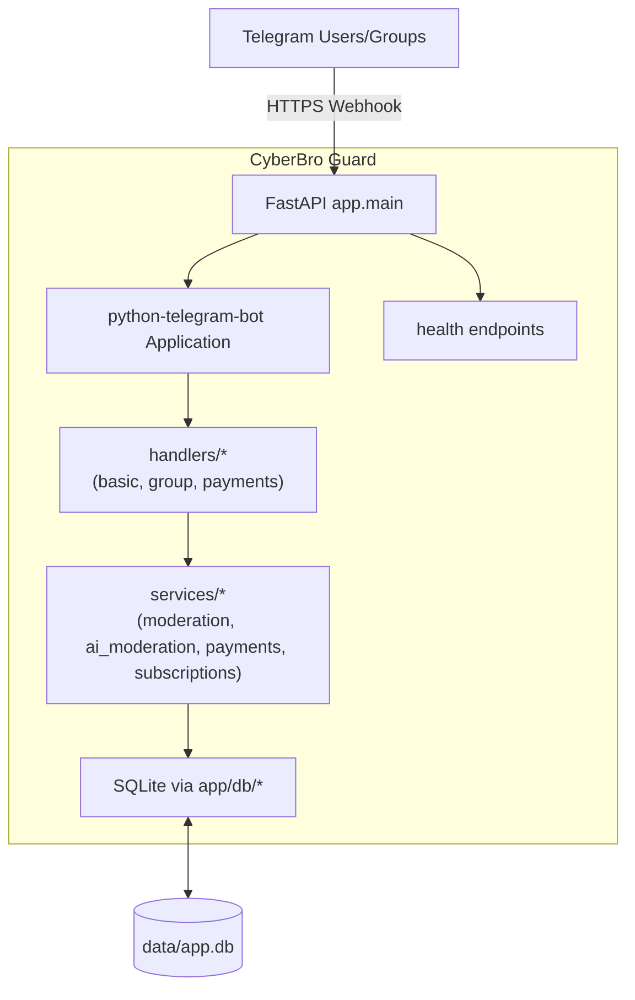

# Архитектура

Слои:
- Handlers: только связывают Telegram Update с доменной логикой, без бизнес‑правил.
- Services: бизнес‑логика (модерация, платежи, напоминания), без I/O кроме зависимостей.
- DB: минимальный sync SQLite слой, вызывается в `asyncio.to_thread` из хендлеров.
- Utils: i18n, callback фабрики и т.п.

Принципы:
- Никаких глобалей: состояние только в PTB `context.user_data/chat_data` и БД.
- Конфиг — через Pydantic Settings из `.env`.
- Логирование — `logging` (INFO/DEBUG), без PII.

Безопасность и надёжность:
- FastAPI `/webhook` проверяет заголовок `X-Telegram-Bot-Api-Secret-Token`, ограничивает тело `MAX_WEBHOOK_BODY`, фильтрует по `ALLOWED_UPDATES`, применяет идемпотентность по `update_id`.
- Callback data подписывается HMAC по `WEBHOOK_SECRET` в формате `v1:<ts>:...:sig` с проверкой TTL `CALLBACK_TTL_S`.
- SQLite с WAL, `busy_timeout`, `foreign_keys=ON`.
- Планировщик APScheduler: `max_instances=1`, coalesce, корректное завершение на shutdown.
- Метрики Prometheus: updates, payments, webhook_dropped, webhook_errors.

