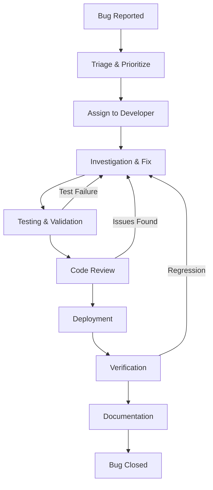

# 🐛 Bug Management Guide

Complete guide for managing bugs from report to resolution in the CyberBro Guard project.

## 📋 Overview

This guide outlines the end-to-end process for handling bugs, ensuring consistent resolution quality and knowledge retention.

## 🔄 Bug Lifecycle

## 🎯 Bug Triage Process

### Severity Classification

| Severity | Definition | Response Time | Examples |
|----------|------------|---------------|----------|
| **Critical** | System down, data loss, security breach | 2 hours | Payment processing broken, authentication bypass |
| **High** | Major feature broken, affects many users | 24 hours | Bot not responding, webhooks failing |
| **Medium** | Feature partially broken, workaround exists | 3 days | UI glitch, slow performance |
| **Low** | Minor issue, cosmetic problem | 1 week | Typos, minor UX improvements |

### Triage Checklist
- [ ] **Reproducibility**: Can the bug be reproduced?
- [ ] **Impact Assessment**: How many users affected?
- [ ] **Severity Assignment**: Critical/High/Medium/Low
- [ ] **Component Identification**: Which system/service?
- [ ] **Assignment**: Who should fix this?

## 🔧 Bug Resolution Process

### Step 1: Investigation Phase

**Use the Bug Resolution Template**
1. Copy `docs/bug_close.md` template
2. Fill in bug information section
3. Document investigation process as you go

**Investigation Checklist:**
- [ ] Reproduce the bug in development
- [ ] Check logs for error patterns
- [ ] Identify affected code/components
- [ ] Determine root cause
- [ ] Assess blast radius (what else might be affected)

### Step 2: Fix Implementation

**Development Standards:**
- [ ] Create feature branch: `fix/bug-[issue-number]-short-description`
- [ ] Implement minimal fix addressing root cause
- [ ] Add comprehensive tests (unit + regression)
- [ ] Update documentation if needed
- [ ] Self-review code before submitting

**Code Quality Requirements:**
- [ ] Fix follows existing code patterns
- [ ] No unrelated changes included
- [ ] Performance impact considered
- [ ] Error handling appropriate
- [ ] Logging added for future debugging

### Step 3: Testing and Validation

**Required Testing:**
- [ ] **Unit Tests**: Test the specific fix
- [ ] **Regression Tests**: Prevent bug from recurring
- [ ] **Integration Tests**: Ensure no side effects
- [ ] **Manual Testing**: Verify fix in realistic scenario

**Testing Standards:**
- Tests must fail before the fix (proving they catch the bug)
- Tests must pass after the fix
- Edge cases must be covered
- Test names should be descriptive

### Step 4: Deployment and Monitoring

**Pre-Deployment:**
- [ ] Code review approved
- [ ] All tests passing
- [ ] Performance validated
- [ ] Rollback plan prepared

**Post-Deployment:**
- [ ] Monitor key metrics for 48 hours
- [ ] Watch for related errors
- [ ] Verify fix works in production
- [ ] Collect user feedback

## 📝 Documentation Requirements

### Bug Resolution Document
Use `docs/bug_close.md` template for all medium+ severity bugs:

**Required Sections:**
- **Root Cause Analysis**: What went wrong and why
- **Fix Implementation**: How the problem was solved
- **Tests Added**: What tests prevent recurrence
- **Metrics Before/After**: Quantitative impact assessment
- **Lessons Learned**: How to prevent similar issues

### GitHub Issue Closure
Use `.github/ISSUE_TEMPLATE/bug_close.md` for closing bug issues:

**Required Evidence:**
- Link to merged PR
- Link to test files
- Screenshot of green CI
- Metrics snapshot showing improvement

## 🎯 Quality Gates

### Before Fix Submission
- [ ] Root cause clearly identified
- [ ] Fix is minimal and targeted
- [ ] Tests prove the bug is fixed
- [ ] No performance regression
- [ ] Documentation updated

### Before Deployment
- [ ] Code review completed
- [ ] All CI checks pass
- [ ] Security review (if applicable)
- [ ] Rollback plan documented
- [ ] Monitoring alerts configured

### Before Bug Closure
- [ ] Fix verified in production
- [ ] Metrics show improvement
- [ ] No regression detected
- [ ] Resolution documented
- [ ] Lessons learned captured

## 📊 Success Metrics

### Process Metrics
- **Mean Time to Resolution (MTTR)**: Average time from report to fix
- **Time to First Response**: How quickly bugs are triaged
- **Regression Rate**: Percentage of bugs that reoccur
- **Fix Quality**: Number of follow-up issues per fix

### Quality Metrics
- **Test Coverage**: Coverage of bug fixes
- **Documentation Quality**: Completeness of resolution docs
- **Knowledge Transfer**: Team understanding of fixes
- **Prevention Effectiveness**: Reduction in similar bugs

## 🛠️ Tools and Templates

### Templates
- [`docs/bug_close.md`](bug_close.md) - Complete resolution documentation
- [`.github/ISSUE_TEMPLATE/bug_close.md`](.github/ISSUE_TEMPLATE/bug_close.md) - GitHub closure checklist
- [`docs/examples/bug_close_example.md`](examples/bug_close_example.md) - Filled example

### Development Tools
- **Local Testing**: `python scripts/check_pr_gate_local.py`
- **Regression Testing**: `python -m pytest tests/regression/ -m regression`
- **Performance Testing**: `python -m pytest tests/ --benchmark`
- **Coverage**: `python -m pytest --cov=app --cov-report=html`

### Monitoring Tools
- **Logs**: Structured JSON logging with correlation IDs
- **Metrics**: Prometheus metrics for error rates and performance
- **Alerts**: Automated notifications for regressions
- **Dashboards**: Grafana dashboards for bug tracking

## 📚 Common Bug Patterns

### Payment System Bugs
**Common Issues:**
- Idempotency failures (duplicate processing)
- Race conditions in subscription updates
- Currency/amount calculation errors
- Webhook processing failures

**Prevention:**
- Always implement idempotency checks
- Use database transactions appropriately
- Add comprehensive payment flow tests
- Monitor payment metrics continuously

### Bot/Webhook Bugs
**Common Issues:**
- Rate limiting errors
- Message formatting problems
- User state inconsistencies
- Telegram API changes

**Prevention:**
- Implement proper rate limiting
- Use structured message templates
- Add state validation tests
- Monitor Telegram API deprecations

### Database Bugs
**Common Issues:**
- Migration failures
- Query performance problems
- Data integrity violations
- Locking/concurrency issues

**Prevention:**
- Test migrations on production-like data
- Monitor query performance
- Use appropriate constraints
- Add concurrency tests

## 🚨 Emergency Procedures

### Critical Bug Response
1. **Immediate Response** (within 2 hours)
   - Acknowledge the issue
   - Assess severity and impact
   - Implement temporary mitigation if possible
   - Notify stakeholders

2. **Investigation** (within 4 hours)
   - Identify root cause
   - Develop fix strategy
   - Prepare rollback plan
   - Estimate fix timeline

3. **Resolution** (within 24 hours)
   - Implement and test fix
   - Deploy to production
   - Verify resolution
   - Conduct post-mortem

### Rollback Procedures
- **Code Rollback**: `git revert` and redeploy
- **Database Rollback**: Use backup restoration procedures
- **Feature Flags**: Disable problematic features
- **Traffic Routing**: Route around broken components

## 📈 Continuous Improvement

### Weekly Bug Review
- Review all bugs closed in the past week
- Identify patterns and trends
- Discuss prevention strategies
- Update processes based on learnings

### Monthly Metrics Review
- Analyze MTTR trends
- Review regression rates
- Assess team performance
- Plan process improvements

### Quarterly Process Updates
- Update templates based on usage
- Revise severity classifications
- Improve automation tools
- Training on new best practices

## 🎓 Training and Onboarding

### New Team Member Checklist
- [ ] Read this bug management guide
- [ ] Review recent bug resolution examples
- [ ] Practice using bug templates
- [ ] Shadow experienced developer on bug fix
- [ ] Complete first bug fix with mentorship

### Skills Development
- **Debugging Skills**: Log analysis, reproduction techniques
- **Testing Skills**: Writing effective regression tests
- **Documentation Skills**: Clear technical writing
- **Communication Skills**: Stakeholder updates, team coordination

## 📞 Support and Resources

### Getting Help
- **Technical Questions**: Ask in #development channel
- **Process Questions**: Consult this guide or ask team lead
- **Urgent Issues**: Contact on-call engineer
- **Tool Issues**: Check documentation or ask DevOps

### Additional Resources
- [Contributing Guidelines](../CONTRIBUTING.md)
- [Testing Standards](testing-standards.md)
- [Deployment Guide](deployment-checklist.md)
- [Monitoring Runbooks](monitoring-runbooks.md)

---

**Guide Version**: 1.0  
**Last Updated**: January 2025  
**Maintained by**: Development Team  
**Review Schedule**: Quarterly
