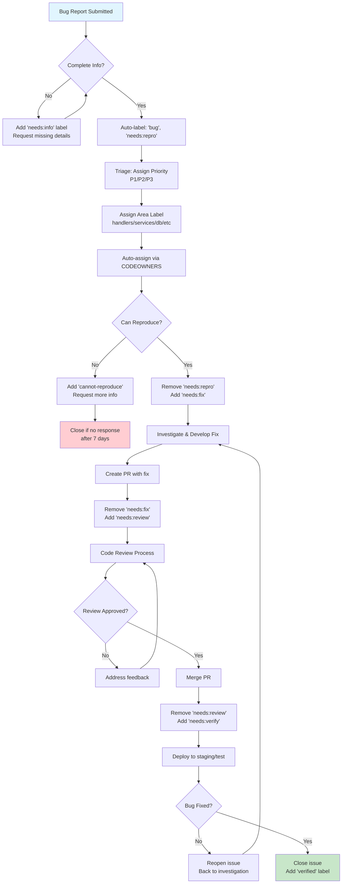

# 🐛 Bug Intake & Resolution Workflow

## Overview
This document describes the standardized process for handling bug reports in CyberBro Guard, from initial intake through resolution and verification.

## 🔄 Bug Lifecycle Flowchart



## 📋 Process Stages

### 1. Intake Stage
- **Trigger**: New bug report submitted via GitHub issue template
- **Auto-labels**: `bug`, `needs:repro`
- **Actions**:
  - Validate required fields are filled
  - If incomplete, add `needs:info` label and request details
  - Auto-assign to area owners via CODEOWNERS

### 2. Triage Stage  
- **Responsible**: Area owners or maintainers
- **Actions**:
  - Assign priority label: `sev:P1`, `sev:P2`, or `sev:P3`
  - Assign area label: `area:handlers`, `area:services`, etc.
  - Initial assessment of complexity and impact

### 3. Reproduction Stage
- **Label**: `needs:repro`
- **Actions**:
  - Follow "Steps to Reproduce" exactly
  - Verify environment matches reported setup
  - If reproducible: remove `needs:repro`, add `needs:fix`
  - If not reproducible: add `cannot-reproduce`, request more info

## 🧠 3 Hypotheses Framework

When investigating bugs, developers should form **exactly 3 testable hypotheses** before diving into code. This structured approach prevents tunnel vision and ensures systematic investigation.

### Hypothesis Formation Checklist

#### Pre-Investigation
- [ ] Read the bug report completely
- [ ] Identify the **expected** vs **actual** behavior
- [ ] Note the **environment** (OS, browser, deployment, etc.)
- [ ] Check for **recent changes** in the affected area
- [ ] Review **similar past issues** for patterns

#### Hypothesis Categories

Form one hypothesis from each category:

**🔄 Process Hypothesis** - Something in the workflow/logic
- [ ] State machine in wrong state?
- [ ] Missing validation step?
- [ ] Race condition between operations?
- [ ] Incorrect sequencing of events?

**💾 Data Hypothesis** - Something with data/storage
- [ ] Database constraint violation?
- [ ] Stale cache/session data?
- [ ] Data migration issue?
- [ ] Concurrent modification conflict?

**🌐 Environment Hypothesis** - Something external/contextual
- [ ] Network timeout or connectivity?
- [ ] Resource exhaustion (memory, disk, connections)?
- [ ] Third-party service degradation?
- [ ] Configuration difference between environments?

### Testing Hypotheses

For each hypothesis, create:

#### Test Plan Template
```
Hypothesis: [Brief description]
Category: [Process/Data/Environment]
Test Steps:
1. [Specific step to verify/disprove]
2. [Expected outcome if hypothesis is correct]
3. [Expected outcome if hypothesis is wrong]

Evidence Collection:
- [ ] Add diagnostic logging with issue_id
- [ ] Capture relevant metrics/traces
- [ ] Document environmental factors
```

#### Example Hypothesis Set

**Bug Report**: "Payment fails with 'already processed' error but user was never charged"

**H1 (Process)**: Payment service returns success but webhook delivery fails, causing state mismatch
```
Test: Check webhook delivery logs for failed/retried deliveries
Evidence: webhook_delivery_status, payment_state_transitions
```

**H2 (Data)**: Idempotency key collision between different payment attempts  
```
Test: Query idempotency store for key conflicts around timeframe
Evidence: idempotency_key_usage, collision_timestamps
```

**H3 (Environment)**: Database connection timeout during transaction commit
```
Test: Check connection pool metrics and transaction duration logs
Evidence: db_connection_pool_size, transaction_duration_ms
```

### Diagnostic Code Integration

Use the diagnostic toolkit to trace hypothesis testing:

```python
from app.utils.diag import trace_section, timer, set_issue_id, set_hypothesis_id

# Set context for bug investigation
set_issue_id("bug-12345")

# Test each hypothesis systematically
for hypothesis_id in ["h1-webhook-failure", "h2-key-collision", "h3-db-timeout"]:
    set_hypothesis_id(hypothesis_id)
    
    with trace_section(f"test_{hypothesis_id}"):
        with timer("evidence_collection"):
            # Collect evidence for this hypothesis
            ...
```

### Hypothesis Outcomes

After testing all 3 hypotheses:

#### ✅ One Confirmed
- [ ] **Document** the root cause clearly
- [ ] **Fix** with targeted solution
- [ ] **Test** that fix resolves the issue
- [ ] **Verify** other hypotheses were indeed wrong

#### ❌ All Disproven  
- [ ] **Expand** the hypothesis space - were categories too narrow?
- [ ] **Re-examine** the bug report - was something missed?
- [ ] **Escalate** for additional investigation resources
- [ ] **Consider** this might be multiple bugs

#### 🔀 Multiple Confirmed
- [ ] **Prioritize** by impact/likelihood
- [ ] **Address** primary cause first
- [ ] **Verify** secondary causes are still relevant after primary fix
- [ ] **Create** separate issues for unrelated causes

### Success Metrics

Track hypothesis framework effectiveness:
- **Time to Resolution**: Should decrease as developers get systematic
- **Fix Accuracy**: Fewer regressions and incomplete fixes
- **Investigation Quality**: Less back-and-forth, more focused debugging

### 4. Investigation & Fix Stage
- **Label**: `needs:fix`
- **Actions**:
  - Analyze root cause using provided hypotheses as starting point
  - Develop fix with appropriate tests
  - Create PR referencing the issue (`Fixes #123`)

### 5. Code Review Stage
- **Label**: `needs:review`
- **Actions**:
  - Area owners review the fix
  - Validate tests cover the bug scenario
  - Ensure no regressions introduced
  - Approve or request changes

### 6. Verification Stage
- **Label**: `needs:verify`
- **Actions**:
  - Deploy fix to staging environment
  - Test original reproduction steps
  - Verify the bug is actually resolved
  - Close issue if verified, reopen if not

## 🏷️ Label System

### Priority Labels
- **`sev:P1`** - Critical: Blocks core functionality, affects all users
- **`sev:P2`** - High: Affects significant functionality or subset of users
- **`sev:P3`** - Medium: Minor functionality impact or workarounds available

### Area Labels
- **`area:handlers`** - Telegram message/callback handlers
- **`area:services`** - Business logic services (payments, moderation, etc.)
- **`area:db`** - Database queries, migrations, schema
- **`area:payments`** - Payment processing, subscriptions
- **`area:queue`** - Background jobs, DLQ, scheduling
- **`area:i18n`** - Internationalization, localization  
- **`area:ci`** - CI/CD, testing, deployment

### Status Labels
- **`needs:info`** - Waiting for more information from reporter
- **`needs:repro`** - Needs reproduction confirmation
- **`needs:fix`** - Confirmed bug, needs implementation
- **`needs:review`** - Fix ready, needs code review
- **`needs:verify`** - Fix merged, needs verification testing
- **`verified`** - Bug confirmed fixed
- **`cannot-reproduce`** - Unable to reproduce reported issue

## ⏱️ SLA Targets

### By Priority
| Priority | First Response | Time to Fix | Time to Verify |
|----------|---------------|-------------|----------------|
| P1       | 4 hours       | 24 hours    | 4 hours        |
| P2       | 24 hours      | 7 days      | 24 hours       |
| P3       | 72 hours      | 30 days     | 72 hours       |

### Response Actions
- **First Response**: Initial triage, labeling, and assignment
- **Time to Fix**: From `needs:fix` to PR merged
- **Time to Verify**: From `needs:verify` to issue closed

## 📊 Metrics & Tracking

### Key Metrics
- **Mean Time to Resolution (MTTR)** by priority
- **Bug reopen rate** (should be <5%)
- **Time in each stage** to identify bottlenecks
- **Area distribution** to identify problematic components

### Automation
- **Auto-stale**: Issues without activity for 30 days get `stale` label
- **Auto-close**: `stale` issues close after 7 days without activity
- **Auto-assign**: CODEOWNERS automatically assigns area experts
- **PR linking**: PRs automatically link to issues via "Fixes #123"

## 🔧 Tools & Integration

### GitHub Features
- Issue templates enforce consistent bug reports
- Labels enable filtering and reporting
- CODEOWNERS ensure proper review assignments
- Projects track progress across stages

### CI/CD Integration  
- All PRs run full test suite
- E2E tests specifically validate bug fixes
- Deployment to staging enables verification testing
- Automated notifications for SLA breaches

## 📚 Best Practices

### For Bug Reporters
- Use the provided template completely
- Include actual logs, not paraphrased errors
- Test on latest commit before reporting
- Provide clear reproduction steps
- Include relevant environment details

### For Developers
- Always reproduce locally before starting fix
- Write test case that fails before the fix
- Reference issue in commit messages and PR
- Test fix in clean environment
- Update documentation if needed

### For Reviewers
- Verify the test case actually catches the bug
- Check for potential side effects or regressions
- Ensure fix is minimal and targeted
- Validate error handling and edge cases
- Confirm deployment safety

## 🔄 Continuous Improvement

This process is reviewed monthly to identify:
- Bottlenecks and delays
- Common bug patterns requiring prevention
- Tool improvements and automation opportunities  
- SLA adjustments based on actual capacity

Feedback on this process is welcome via GitHub discussions.
