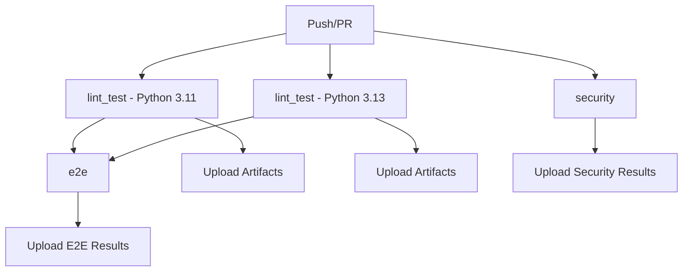

# CI/CD Documentation

## Overview

CyberBro Guard использует GitHub Actions для автоматизированной проверки качества кода, тестирования и security scanning'а. CI pipeline запускается автоматически при push'ах и pull request'ах.

## CI Pipeline Structure

### Jobs Overview



### Pipeline Jobs

1. **lint_test** (Matrix: Python 3.11, 3.13)
   - Code linting с ruff
   - Type checking с mypy
   - Unit tests с pytest
   - Coverage reporting

2. **e2e** (depends on lint_test)
   - End-to-end testing с Playwright
   - Docker environment testing
   - Webhook integration testing

3. **security** (parallel)
   - Vulnerability scanning с Trivy
   - Security linting с Bandit
   - SARIF reporting

## Running Tests Locally

### Prerequisites

```bash
# Install development dependencies
pip install -r requirements.txt -r requirements-dev.txt

# Install Playwright browsers (для E2E tests)
playwright install chromium
```

### Code Quality Checks

```bash
# Linting
ruff check .
ruff format --check .

# Type checking
mypy app --ignore-missing-imports

# All quality checks (как в CI)
make lint && make type
```

### Unit Tests

```bash
# Run all tests
pytest tests/ -v

# Run with coverage
pytest tests/ -v --cov=app --cov-report=html --cov-report=term-missing

# Run specific test file
pytest tests/test_webhook_hardening.py -v

# Run tests matching pattern
pytest tests/ -k "test_payment" -v
```

### E2E Tests

```bash
# Start test environment
docker-compose up -d

# Wait for services to be ready
sleep 10
curl -f http://localhost:8080/readyz

# Run E2E tests
pytest tests/e2e/ -v --html=reports/e2e-report.html

# Cleanup
docker-compose down -v
```

### Security Scanning

```bash
# Install tools
pip install bandit[toml]

# Run Bandit (Python security linting)
bandit -r app/ -f txt

# Run Trivy (dependency scanning)
docker run --rm -v ${PWD}:/workspace aquasec/trivy fs /workspace
```

## CI Environment Variables

### Required for Tests
```bash
export PYTEST_CURRENT_TEST=1
export BOT_TOKEN=test_token
export WEBHOOK_SECRET=test_secret
export DEBUG=true
```

### E2E Tests
```bash
export E2E_BASE_URL=http://localhost:8080
export PLAYWRIGHT_BROWSERS_PATH=/path/to/browsers
```

## Interpreting CI Results

### GitHub Actions UI

1. **Navigate to Actions tab** в GitHub repository
2. **Select workflow run** для просмотра детальных результатов
3. **Click on job** для просмотра logs и steps
4. **Download artifacts** для offline анализа

### Artifacts Explanation

#### Test Results
- **`test-results-python-X.X/`**
  - `pytest-X.X.xml` - JUnit XML для GitHub UI integration
  - `coverage-X.X.xml` - Coverage data для Codecov
  - `htmlcov-X.X/` - HTML coverage report (открыть `index.html`)

#### E2E Results
- **`e2e-artifacts/`**
  - `e2e-results.xml` - E2E test results
  - `e2e-report.html` - Detailed HTML report с screenshots
  - `logs/` - Service logs и container outputs
  - `test-results/` - Playwright artifacts (videos, traces)

#### Security Results
- **`security-results/`**
  - `trivy-results.sarif` - Vulnerability scan results
  - `bandit-results.json` - Security linting results

### Reading Coverage Reports

#### HTML Coverage Report
1. Download `htmlcov-X.X` artifact
2. Extract и открыть `htmlcov-X.X/index.html`
3. **Green lines**: Covered by tests
4. **Red lines**: Not covered
5. **Yellow lines**: Partially covered (e.g., branches)

#### Coverage Metrics
- **Line Coverage**: % строк кода, выполненных в тестах
- **Branch Coverage**: % условных переходов, протестированных
- **Function Coverage**: % функций, вызванных в тестах

**Target**: ≥ 80% line coverage для production code

### Understanding Test Failures

#### Common Failure Types

1. **Linting Failures**
   ```
   app/main.py:42:1: E302 expected 2 blank lines, found 1
   ```
   **Fix**: Исправить стиль кода согласно ruff rules

2. **Type Check Failures**
   ```
   app/services/ai.py:15: error: Argument 1 to "moderate" has incompatible type "str | None"; expected "str"
   ```
   **Fix**: Добавить type guards или правильную типизацию

3. **Unit Test Failures**
   ```
   FAILED tests/test_payments.py::test_payment_idempotency - AssertionError: Expected 1, got 2
   ```
   **Fix**: Проверить тестовые данные и логику

4. **E2E Test Failures**
   ```
   playwright._impl._api_types.TimeoutError: Timeout 30000ms exceeded
   ```
   **Fix**: Увеличить timeouts или исправить селекторы

5. **Security Scan Failures**
   ```
   HIGH: SQL injection vulnerability detected in app/db/queries.py:45
   ```
   **Fix**: Использовать parameterized queries или whitelist

## Local Development Workflow

### Pre-commit Workflow

```bash
# Before committing
make lint    # Fix any style issues
make type    # Address type errors
pytest tests/ -x  # Run tests, stop on first failure

# For faster feedback during development
pytest tests/test_specific_feature.py -v
```

### Debugging Failed Tests

#### Unit Tests
```bash
# Run with verbose output
pytest tests/test_failing.py -v -s

# Run with debugger
pytest tests/test_failing.py --pdb

# Run with coverage для missing lines
pytest tests/test_failing.py --cov=app --cov-report=term-missing
```

#### E2E Tests
```bash
# Run in headed mode (GUI browser)
pytest tests/e2e/ --headed

# Run with video recording
pytest tests/e2e/ --video=on

# Generate trace для debugging
pytest tests/e2e/ --tracing=on
```

#### Environment Issues
```bash
# Check service health
curl http://localhost:8080/readyz
curl http://localhost:8080/status

# Check Docker containers
docker-compose ps
docker-compose logs bot

# Reset environment
docker-compose down -v
docker-compose up -d
```

## Performance Optimization

### Speeding Up Local Tests

#### Pytest Optimizations
```bash
# Run tests in parallel
pytest tests/ -n auto  # requires pytest-xdist

# Skip slow tests during development
pytest tests/ -m "not slow"

# Use pytest cache для failed tests
pytest tests/ --lf  # last failed
pytest tests/ --ff  # failed first
```

#### Docker Optimizations
```bash
# Pre-build test image
docker build -t cyberbro-guard:test .

# Use Docker layer caching
export DOCKER_BUILDKIT=1
```

### CI Cache Utilization

CI автоматически кеширует:
- **pip dependencies** по requirements.txt hash
- **Playwright browsers** по version
- **Docker layers** где применимо

Для обновления cache:
1. Обновите requirements.txt
2. Push changes - cache автоматически rebuild

## Troubleshooting Common Issues

### Issue: "Module not found" in tests
```bash
# Solution: Install in development mode
pip install -e .

# Or add to PYTHONPATH
export PYTHONPATH="${PYTHONPATH}:${PWD}"
```

### Issue: Playwright browsers missing
```bash
# Solution: Reinstall browsers
playwright install chromium
playwright install-deps
```

### Issue: Database locked errors
```bash
# Solution: Check for leftover connections
pkill -f pytest  # Kill any hanging test processes
rm -f data/app.db-wal data/app.db-shm  # Remove SQLite WAL files
```

### Issue: Docker permission denied
```bash
# Linux solution: Add user to docker group
sudo usermod -aG docker $USER
newgrp docker

# Or run with sudo
sudo docker-compose up -d
```

### Issue: Port already in use (8080)
```bash
# Find process using port
lsof -i :8080  # macOS/Linux
netstat -ano | findstr :8080  # Windows

# Kill process or use different port
export PORT=8081
```

## CI Badge Status

### Badge Types

| Badge | Meaning | Action |
|-------|---------|--------|
|  | All checks pass | ✅ Ready для merge |
|  | Tests или linting failed | ❌ Fix issues |
|  | CI in progress | ⏳ Wait for completion |

### Coverage Badge
- **90%+**: Excellent coverage ✅
- **80-89%**: Good coverage ✅  
- **70-79%**: Acceptable coverage ⚠️
- **<70%**: Needs improvement ❌

## Integration with Development Workflow

### Pull Request Process

1. **Create PR** → CI automatically triggered
2. **Review CI results** в PR checks section
3. **Fix any failures** → push updates
4. **Green CI** → ready для code review
5. **Approval + green CI** → merge allowed

### Branch Protection Rules

Main и release branches защищены и требуют:
- ✅ CI checks passing
- ✅ Up-to-date с main branch
- ✅ Code review approval
- ✅ No merge commits

### Continuous Integration Best Practices

#### For Developers
- **Run tests locally** before pushing
- **Keep commits small** для easier CI debugging
- **Write descriptive commit messages** для better CI logs
- **Monitor CI feedback** и fix promptly

#### For Reviewers
- **Check CI status** before approving
- **Review coverage reports** для new code
- **Validate security scan results**
- **Ensure E2E tests cover new features**

## Resources

### Documentation Links
- [GitHub Actions Documentation](https://docs.github.com/en/actions)
- [Pytest Documentation](https://docs.pytest.org/)
- [Playwright Documentation](https://playwright.dev/python/)
- [Ruff Documentation](https://docs.astral.sh/ruff/)

### Internal Links
- [CI Specification](./spec.md)
- [CI Scope Document](./scope.md)
- [Architecture Overview](./architecture.md)
- [Security Guidelines](../SECURITY.md)

### Support
- **CI Issues**: Create GitHub issue с `ci` label
- **Test Failures**: Include CI logs и local reproduction steps
- **Performance Issues**: Mention build times и artifact sizes
- **Security Concerns**: Follow security reporting process


